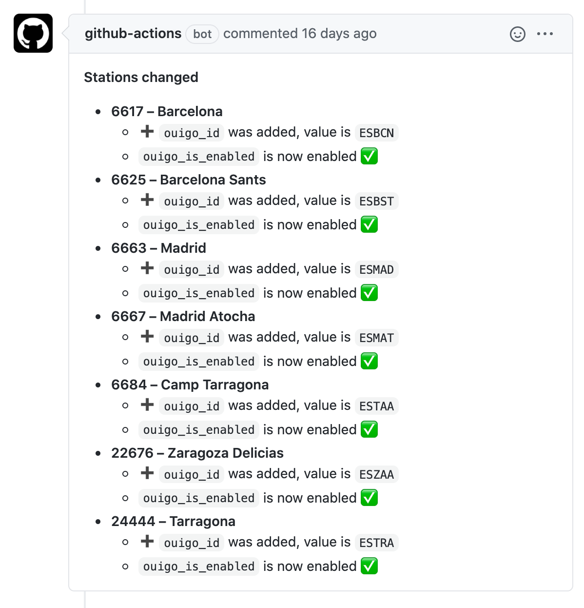

# Stations::Human::Diff

Pretty print stations.csv diffs on pull requests.

## Usage

You may test it locally by setting the desired repository `GITHUB_REPOSITORY` and your personal `GITHUB_TOKEN` in order to comment.

And then, run `entrypoint.sh`.
